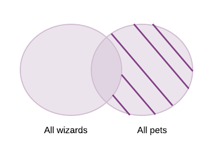

Querying data with SQL can feel magical, and JOINS are one of the things that feel the most magical to me. In this article, I'm going to explain the magic behind joins. 

We will cover: 
1. Left Joins 
2. Inner Joins 
3. Outer Joins

--- 

Let's start with some setup and talk about the pets of the wizarding world. Students at Hogwarts are allowed to bring with them an owl OR a cat OR a toad. 

Let's consider a table to hold some of the students at Hogwarts. The table will have the following schema:
1. `id` : A unique id used to identify a wizarding student 
2. `name` : The student's full name 
3. `house` : Their hogwarts house 

Here's the table, populated with some students: 

 id |        name        |   house    
----|--------------------|------------
  1 | Neville Longbottom | Gryffindor
  2 | Ronald Weasley     | Gryffindor
  3 | Harry Potter       | Gryffindor
  4 | Draco Malfoy       | Slytherin
  5 | Seamus Finnigan    | Gryffindor
  6 | Hermione Granger   | Gryffindor
  
  Now, let's create a table to hold information about the student's pets. The table will have the following schema: 
  1. `id`: Unique id used to identify the pet 
  2. `name` : The name of the pet 
  3. `species`: The species of the pet. 
  4. `owner_id`: The id of the owner of the pet. In general, `pet.owner_id` equals `wizard.id`. In database-ey terms, we think of this as a foreign key. (We will not be explicitly specifying a foreign key relation here) 
  
  Here is a table with some pets.
  
  id |    name     | species | owner_id 
----|-------------|---------|----------
  2 | Trevor      | toad    |        1
  1 | Scabbers    | rat     |        2
  3 | Hedwig      | owl     |        3
  4 | Crookshanks | cat     |        6
  5 | unknown     | owl     |        4
  6 | Norbert     | Dragon  |      100
  7 | Brodwin     | owl     |       10
  
  Let's confirm our understanding of this table is correct, by looking at the pet with id = 3. The pet's name is Hedwig, and it's owner_id is 3. Looking at the `wizard` table, Harry Potter has an id of 3. The data indicates that Harry Potter owns Hedwig, which is what we would expect. 


## 1.Left Joins:

#### The Fat Lady's portrait is updating her knowledge to make sure only authorized folks have access to the Gryffindor dorm. Can we write a query that will inform us of all the students and pets that are allowed in the Gryffindor dormitory?

Let's break down the requirements. We need:

1. All the students who are allowed in the Gryffindor dormitory
2. Any pets that belong to students from Gryffindor

Let's start by using a set diagram to understand what data we need: 
  
  

It looks like we need _all the data in the left hand side table, along with any common data_. Thinking about the join's available to us, this sounds a lot like a `LEFT JOIN`. Let's write some SQL. 

1. Start by extracting the data we need from the `wizards` table. We want to filter the data to the student's who are in the Gryffindor house. We can do that with a `WHERE` clause. 

```postgres

postgres=# `SELECT * FROM wizard WHERE house = 'Gryffindor'` 

id |        name        |   house    
----|--------------------|------------
  1 | Neville Longbottom | Gryffindor
  2 | Ronald Weasley     | Gryffindor
  3 | Harry Potter       | Gryffindor
  5 | Seamus Finnigan    | Gryffindor
  6 | Hermione Granger   | Gryffindor
  
```
  
The query returned every student in the table except Malfoy, who is in Slytherin. 
  
2. Now, let's write a JOIN to combine this data with that of the `pet` table: 

```sh 

postgres=#
SELECT * FROM wizard LEFT JOIN pet ON wizard.id = pet.owner_id WHERE house = 'Gryffindor'; 
 id |        name        |   house    | id |    name     | species | owner_id 
----+--------------------+------------+----+-------------+---------+----------
  1 | Neville Longbottom | Gryffindor |  2 | Trevor      | toad    |        1
  2 | Ronald Weasley     | Gryffindor |  1 | Scabbers    | rat     |        2
  3 | Harry Potter       | Gryffindor |  3 | Hedwig      | owl     |        3
  6 | Hermione Granger   | Gryffindor |  4 | Crookshanks | cat     |        6
  5 | Seamus Finnigan    | Gryffindor |    |             |         |         
(5 rows)
```

I see all the student's in Gryffindor, and all the appropriate pets. But, we have too many rows.

3.Let's filter down to only select the fields we need. 

```sh

postgres= #
SELECT wizard.name, pet.name FROM wizard LEFT JOIN pet ON wizard.id = pet.owner_id WHERE house = 'Gryffindor';
        name        |    name     
--------------------+-------------
 Neville Longbottom | Trevor
 Ronald Weasley     | Scabbers
 Harry Potter       | Hedwig
 Hermione Granger   | Crookshanks
 Seamus Finnigan    | 
(5 rows)

```
This all looks good. Let's step through this query.
 
  1. `SELECT wizard.name, pet.name`: The SELECT clause specifies the fields we want to see in our results. We're only interested in the wizard's name, and the pet's name
  2. `FROM wizard` : The first table, or the table on the left for our join 
  3. `LEFT JOIN pet` : the LEFT JOIN clause 
  4. `ON wizard.id = pet.owner_id` :  We specify what we are joining ON. This is generally a field present in both tables, that has a foreign-key-esque relationship 
  5. `WHERE house = 'Gryffindor';` : We filter down our results to only include rows where the wizard's house is in Gryffindor. We don't need to specify `wizard.house`, because the `pet` table does not include that column. 
  
Our table has very few rows, so we probably won't run into any performance issues. However, I generally like looking at the query planner and look at the execution plan.  We can use postgres's `EXPLAIN ANALYZE` clause for this. 

```sh 
postgres=#
EXPLAIN ANALYZE SELECT wizard.name, pet.name FROM wizard
LEFT JOIN pet ON wizard.id = pet.owner_id WHERE wizard.house = 'Gryffindor';
                                                  QUERY PLAN                                                   
---------------------------------------------------------------------------------------------------------------
 1. Hash Right Join  (cost=14.90..29.05 rows=3 width=236) (actual time=0.045..0.056 rows=5 loops=1)
 2.   Hash Cond: (pet.owner_id = wizard.id)
 3.   ->  Seq Scan on pet  (cost=0.00..13.00 rows=300 width=122) (actual time=0.006..0.008 rows=6 loops=1)
 4.   ->  Hash  (cost=14.88..14.88 rows=2 width=122) (actual time=0.030..0.030 rows=5 loops=1)
 5.         Buckets: 1024  Batches: 1  Memory Usage: 9kB
 6.         ->  Seq Scan on wizard  (cost=0.00..14.88 rows=2 width=122) (actual time=0.020..0.023 rows=5 loops=1)
 7.              Filter: ((house)::text = 'Gryffindor'::text)
 8.              Rows Removed by Filter: 1
 Planning Time: 0.122 ms
 Execution Time: 0.091 ms
(10 rows)

```
In general, the most indented piece of the `EXPLAIN` output is executed first. Towards the bottom of the output, we see that we performed a scan on the wizards table, and filtered out all rows whose owners were not in Gryffindor. This means that we won't be scanning and joining unnecessary data. 

You might see the `Hash Right Join` at the start output, and be confused about the discrepency between our SQL syntax, and how the query planner wants to operate.

The answer can be found in Postgres's documentation. It turns out, for hash joins, postgres will load the data for the table on the right first 

_hash join: the right relation is first scanned and loaded into a hash table, using its join attributes as hash keys. Next the left relation is scanned and the appropriate values of every row found are used as hash keys to locate the matching rows in the table._ 

This doesn't impact our query. Lines 1-4 specify the type of join Postgres is running (a hash join), and lists how the query planner will access the data. There is timing information in the output, which we will ignore for now.  


## 2. Inner Joins:
#### Luna Lovegood wants to send a letter but none of the school owls are available. Can we write a query that will return the name of all the students who have owls, so she can find one to borrow?? 

Let's start by thinking of the data we need from each table: 
1. From the `pet` table, we want all the pets that are owls 
2. From the `wizard` table, we want all the wizards who have pets that are owls

Drawing a quick venn diagram, the relationship might look something like this: 


Since we are only interested in data present in both tables, we will write an inner join. Let's write some SQL: 

1. First, let's get all pets that are owls: 

```sh 

postgres=# 
SELECT * FROM pet WHERE species = 'owl';
 id |  name   | species | owner_id 
----+---------+---------+----------
  3 | Hedwig  | owl     |        3
  5 | unknown  | owl     |        4
  7 | Brodwin | owl     |       10
(3 rows)

```
Our query returned 3 owls. We can't just send someone's owl on an errand, so we will have to join this with the owners table 

2. Let's write a JOIN:

```sh 
postgres=# 
SELECT * FROM pet JOIN wizard ON wizard.id = pet.owner_id WHERE pet.species = 'owl';
 id |  name  | species | owner_id | id |     name     |   house    
----+--------+---------+----------+----+--------------+------------
  3 | Hedwig | owl     |        3 |  3 | Harry Potter | Gryffindor
  5 | unknown | owl     |        4 |  4 | Draco Malfoy | Slytherin
(2 rows)

```
Nice, it looks like we only have 2 rows. There is no wizard with an `owner_id` of 10 in the wizards table, so it's appropriate that Brodwin the owl is not present in our data.

3. Let's now just filter down to the columns we need: 

```sh 
postgres=#
SELECT wizard.name, pet.name FROM pet JOIN wizard ON wizard.id = pet.owner_id WHERE pet.species = 'owl';
     name     |  name  
--------------+--------
 Harry Potter | Hedwig
 Draco Malfoy | unknown
(2 rows)
```

We have the data we need -- let's step through this query.

1. `SELECT wizard.name, pet.name` : We want to select just two fields; the name of the pet, and the name of the wizard. 
2. `FROM pet` : pet is our first table, or the table to the left 
3. `JOIN wizard` :  When we don't specify a type of join, it is assumed we want to run an inner join 
4. `ON wizard.id = pet.owner_id` : The ON clause
5. `WHERE pet.species = 'owl';` : We filter down to only pets that are owls 

The `INNER JOIN` clause also comes with alternate syntax, which has slightly fewer words to type. 
You could run: 
```sql 
SELECT wizard.name, pet.name
FROM pet, wizard
WHERE wizard.id = pet.owner_id
AND pet.species = 'owl'
```
Notice that the `JOIN .. ON` statement is absent. Instead, we specify both the tables in the `FROM` clause, and specify the condition with `WHERE`. Let's see this in action 

```sh 
postgres=#
SELECT wizard.name, pet.name FROM pet, wizard WHERE wizard.id = pet.owner_id AND pet.species = 'owl';
     name     |  name  
--------------+--------
 Harry Potter | Hedwig
 Draco Malfoy | unknown
(2 rows)
```

Nice, this returned the same data. We've learnt about the `INNER JOIN`!  

## 3.1 Left Outer Join:
#### Hagrid has some extra pets, and he's thinking about giving some away as Christmas gifts. To do this, he wants to find the names of all the students who don't have pets. Can we help him?

We want all the students who don't have pets. Let's start by visualizing this: 


Looking at the diagram, this looks very similar to the one for our left join, except that we now want to exclude data that is present in both the tables. 

Let's start writing the query. 

1. First, we will write a left join. This will give us all the wizards, and attach their pets if they have them: 

```sh 
postgres=#
SELECT * FROM wizard LEFT JOIN pet ON wizard.id = pet.owner_id;
 id |        name        |   house    | id |    name     | species | owner_id 
----+--------------------+------------+----+-------------+---------+----------
  1 | Neville Longbottom | Gryffindor |  2 | Trevor      | toad    |        1
  2 | Ronald Weasley     | Gryffindor |  1 | Scabbers    | rat     |        2
  3 | Harry Potter       | Gryffindor |  3 | Hedwig      | owl     |        3
  5 | Seamus Finnigan    | Gryffindor |    |             |         |         
  6 | Hermione Granger   | Gryffindor |  4 | Crookshanks | cat     |        6
  4 | Draco Malfoy       | Slytherin  |  5 | unknown      | owl     |        4
(6 rows)
```
All 6 rows in our wizards table are present. If a wizard has a pet, they have been added.

2. Looking at the data above, you might notice that the `owner_id` is blank for the wizards that did not have pets. Let's use that to filter down to just the wizards that have no pets: 

```sh 
SELECT * FROM wizard LEFT JOIN pet ON wizard.id = pet.owner_id WHERE pet.owner_id IS NULL;
 id |      name       |   house    | id | name | species | owner_id 
----+-----------------+------------+----+------+---------+----------
  5 | Seamus Finnigan | Gryffindor |    |      |         |         
(1 row)
```

Yay! We just return Seamus Finnigan's name. According to our dataset, he is the only wizard without a pet. 

## 3.2 Right Outer Join:
#### Hagrid is very worried about abandoned pets, and wants to make sure that all pets without owners are being fed. Can we help him find all the pets that don't have owners listed? 

Let's start by visualizing the data we need, using a set diagram: 



This is very similar to the example we just discussed with the `LEFT OUTER JOIN` above. Let's try and write some SQl. 

1. Let's write a RIGHT JOIN, that will give us all the pet's, and attach their owner's if they have them: 

```sh 
postgres=#                                                                                                     
SELECT * FROM wizard RIGHT JOIN pet ON wizard.id = pet.owner_id;
 id |        name        |   house    | id |    name     | species | owner_id 
----+--------------------+------------+----+-------------+---------+----------
  1 | Neville Longbottom | Gryffindor |  2 | Trevor      | toad    |        1
  2 | Ronald Weasley     | Gryffindor |  1 | Scabbers    | rat     |        2
  3 | Harry Potter       | Gryffindor |  3 | Hedwig      | owl     |        3
  6 | Hermione Granger   | Gryffindor |  4 | Crookshanks | cat     |        6
  4 | Draco Malfoy       | Slytherin  |  5 | unknown      | owl     |        4
    |                    |            |  7 | Brodwin     | owl     |       10
    |                    |            |  6 | Norbert     | Dragon  |      100
(7 rows)
```

2. The pet's without owners have the `wizard.id` field blank. Let's use this to just return the pet's with no listed owners: 

```sh 
postgres=# 
SELECT pet.name FROM wizard RIGHT JOIN pet ON wizard.id = pet.owner_id WHERE wizard.name IS null;
  name   
---------
 Brodwin
 Norbert
(2 rows)

postgres=# 
```

Let's examine the SQL:

1. SELECT pet.name : Select only the pet's name  
2. FROM wizard : the table on the left 
3. RIGHT JOIN pet : the table on the right 
4. ON wizard.id = pet.owner_id : the join clause, which specifies how we want the rows from the two tables to be joined
5. WHERE wizard.name IS null; : filtering out all the rows that are present in both tables, leaving behind only the rows from the pets table, that are not present in the wizards table 

We have written a left and a write outer join! 
___
References 
1. Postgres docs for planner optimizer : https://www.postgresql.org/docs/12/planner-optimizer.html
