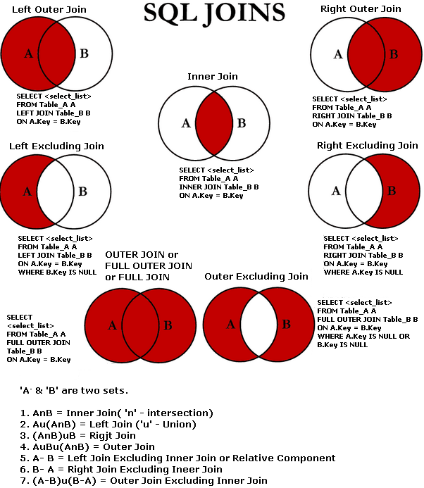
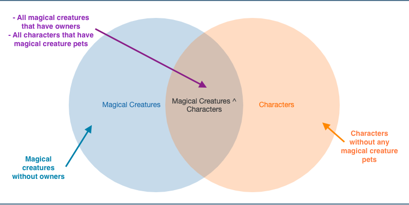

# SQLForThePotterhead

## Prerequisites 
####  install Postgress 
####  load data 

## Queries! 

#### Let's explore the database 

###### List all tables 
Since we are using [psql](https://www.postgresql.org/docs/10/app-psql.html#:~:text=psql%20is%20a%20terminal%2Dbased,or%20from%20command%20line%20arguments.) we can issue a meta command to list the tables.

```sh 
potter=# \d
                    List of relations
 Schema |            Name             | Type  |  Owner
--------+-----------------------------+-------+----------
 public | characters                  | table | kshethia
 public | hogwarts_staff              | table | kshethia
 public | magical_creatures           | table | kshethia
 public | philosophers_stone_dialogue | table | kshethia
 public | potions                     | table | kshethia
 public | spells                      | table | kshethia
(6 rows)

```

###### Explore the table structure 
Now, we want to know what is the structure of these tables.

```sh
potter=# \d spells
                         Table "public.spells"
   Column    |          Type          | Collation | Nullable | Default
-------------+------------------------+-----------+----------+---------
 name        | character varying(50)  |           |          |
 incantation | character varying(50)  |           |          |
 type        | character varying(200) |           |          |
 effect      | character varying(250) |           |          |
 light       | character varying(50)  |           |          |
``` 

- A database (db) typically has a bunch of individual tables in it.
- The `potter` database has 6 tables present, each with its own structure. 
- The `spells` table has 5 columns of type `varchar`. You can think of this as a string field, the [docs](https://www.postgresql.org/docs/9.3/datatype-character.html) explain the nuances behind the type well.  

###### Exercise: 
Look at the schema of all the other tables in the `potter` database. 

[Solution](solutions/list_all_schemas.md) 

#### SELECT -ing data from tables

###### Select all the data from a table 

```sql
SELECT *
FROM magical_creatures;
```
The `*` tells SQL to select all the fields (`name`, `breed` and `owner`) from the `magical_creatures` table

```sh
    name     |       breed       |                  owner
-------------+-------------------+-----------------------------------------
 Crookshanks | Cat               | Hermione Jean Granger
 Dobby       | House Elf         | Lucius Malfoy
 Fawkes      | Phoenix           | Albus Percival Wulfric Brian Dumbledore
 Firenze     | Centuar           |
 Griphook    | Goblin            |
 Hedwig      | Owl               | Harry James Potter
 Hokey       | House Elf         | Hepzibah Smith
 Kreacher    | House Elf         | Sirius Black
 Nagini      | Snake             | Tom Marvolo Riddle
 Peeves      | Poltergeist       |
 Winky       | House Elf         | Barty Crouch Jr
 Scabbers    | Rat               | Ronald Bilius Weasley
 Pigwidgeon  | Owl               | Ronald Bilius Weasley
 Hermes      | Owl               | Percy Ignatius Weasley
 Errol       | Owl               | Weasley family
 Arnold      | Pygmy Puff        | Ginevra (Ginny) Molly Weasley
 Aragog      | Spider            | Rubeus Hagrid
 Buckbeak    | Hippogriff        | Rubeus Hagrid
 Fluffy      | Dog(three headed) | Rubeus Hagrid
 Tenebrus    | Thestral          | Rubeus Hagrid
(20 rows)
```

###### Only select certain fields from a table

```sql

SELECT name 
FROM hogwarts_staff;
```

This tells SQL to only select the `name` field from the `hogwarts` staff table. 

```sh 
                  name
-----------------------------------------
 Cuthbert Binns
 Charity Burbage
 Amycus Carrow
 Alecto Carrow
 Albus Percival Wulfric Brian Dumbledore
 Argus Filch
 Firenze
 Filius Flitwick
 Wilhelmina Grubbly-Plank
 Rubeus Hagrid
 Rolanda Hooch
 Silvanus Kettleburn
 Gilderoy Lockhart
 Remus John Lupin
 Minerva McGonagall
 Alastor Moody
 Irma Pince
 Poppy Pomfrey
 Quirinus Quirrell
 Aurora Sinistra
 Horace Eugene Flaccus Slughorn
 Severus Snape
 Pomona Sprout
 Sybill Patricia Trelawney
 Dolores Jane Umbridge
 Septima Vector
(26 rows)
```
###### Add a LIMIT 

```sql
SELECT name, job
FROM characters
LIMIT 2;
```
If you have a large table (with hundreds of thousands of rows) you often don't want to return all the rows. 
`SQL` has a built in `LIMIT` clause which will let you specify how many rows you want returned. 

```sh 
         name          |   job
-----------------------+---------
 Harry James Potter    | Student
 Ronald Bilius Weasley | Student
(2 rows)
```
Note: there is no guarantee of ordering in a limit clause. You might see different rows returned. 

###### Select data that meets a certain with the WHERE clause

``` SQL 
SELECT name, house
FROM characters
WHERE house = 'Slytherin'
LIMIT 5;
```
Adding a `WHERE` clause will help filter results. 
```sh 
          name          |   house
------------------------+-----------
 Salazar Slytherin      | Slytherin
 Regulus Arcturus Black | Slytherin
 Bloody Baron           | Slytherin
 Severus Snape          | Slytherin
 Tom Marvolo Riddle     | Slytherin
(5 rows)

```

You can specify multiple conditions. 

```sql
SELECT name, house, job
FROM characters
WHERE house = 'Slytherin' AND job = 'Student';
```
The above query will return all the characters who are in Slytherin and who are listed as students. 

```sh 
           name           |   house   |   job
--------------------------+-----------+---------
 Tom Marvolo Riddle       | Slytherin | Student
 Graham Montague          | Slytherin | Student
 Draco Malfoy             | Slytherin | Student
 Vincent Crabbe           | Slytherin | Student
 Gregory Goyle            | Slytherin | Student
 Pansy Parkinson          | Slytherin | Student
 Blaise Zabini            | Slytherin | Student
 Theodore Nott            | Slytherin | Student
 Millicent Bulstrode      | Slytherin | Student
 Marcus Flint             | Slytherin | Student
 Albus Severus Potter     | Slytherin | Student
 Scorpius Hyperion Malfoy | Slytherin | Student
(12 rows)
```

You might notice that ` Severus Snape ` is absent from the results.
Let's look at what his job is listed as in our table. 

```sql
 SELECT name, house, job
FROM characters
WHERE name = 'Severus Snape';
```

```sh 
     name      |   house   |                   job
---------------+-----------+------------------------------------------
 Severus Snape | Slytherin | Professor of Potions | Head of Slytherin
(1 row)
```

###### Exercise: 

1. Hermione is trying to study for her first year final exams. Find the names of all the potions that are a beginners difficulty level to help her study
2. Professor Quirrell has a hard time remembering things -- find the subject that Professor “Septima Vector” teaches at Hogwarts 
3. Who says :`There will be no foolish wand-waving or silly incantations in this class.` in the first movie 

[Solution](solutions/select_ans.md) 

#### De-duping rows with `SELECT DISTINCT`

Sometimes we want to know all the possible values of a field in our data. We can use the `distinct` clause to ask sql to de-dupe (de-duplicate) our data for us. 

```sql
SELECT DISTINCT difficulty_level
FROM potions;
``` 

```sh 
  difficulty_level
----------------------

 O.W.L. level
 Above second year
 Beginner
 Advanced
 Simple to moderate
 Moderate
 Moderate to advanced
(8 rows)
```

note: by default psql displays `nulls` as empty strings. 
You can change this behaviour using `\pset`

 ```
potter=# \pset null (NULL)
Null display is "(NULL)".

```

Now run your query once again: 

```sh 
potter=# SELECT DISTINCT difficulty_level FROM potions;
   difficulty_level
----------------------
 (NULL)
 O.W.L. level
 Above second year
 Beginner
 Advanced
 Simple to moderate
 Moderate
 Moderate to advanced
(8 rows)
```

###### Exercise: 
1. Hagrid is doing research for a book he is writing on Magical Creatures. Find the distinct breeds of magical creatures in our table 
2. The muggle prime minister is furious after learning about magic, and is demanding a list of all types of magical spells. To pacify him, Cornelius Fudge decides to comply. Can you find all the distinct types of spells? 

[Solution](solutions/select_distinct.md)

#### COUNT -ing the number of results 

```sql 
SELECT count(*)
FROM characters;
```
Here we tell SQL to count all the rows in the `characters` table 

```sh 
 count
-------
   140
(1 row)

```

You can add combine this with a `WHERE` clause to filter down the results. 

```sql
SELECT count(*)
FROM characters
WHERE house='Gryffindor';
```

```sh 
 count
-------
    38
(1 row)
```

###### Exercise: 
1. The Ministry of Magic wants to conduct an owl census. They want to know how many Owls they have counted so far. Can you get this information from the magical_creatures table? 

[Solution](solutions/count.md)

#### Comparing data in SQL

###### NULL equality 
```sql 
SELECT *
FROM magical_creatures
WHERE owner IS NULL;
```

```sh 
   name   |    breed    | owner
----------+-------------+--------
 Firenze  | Centuar     | (NULL)
 Griphook | Goblin      | (NULL)
 Peeves   | Poltergeist | (NULL)
(3 rows)

```

Note: we do not use `=` to check for `NULL` equality in SQL. 
The following SQL will return no results: `SELECT * FROM magical_creatures WHERE owner = NULL;`
[Here](https://www.postgresqltutorial.com/postgresql-is-null/#:~:text=NULL%20is%20not%20a%20value,which%20means%20an%20unknown%20result.) is some documentation on NULL values.

###### Case sensitivity

All string comparisons are case sensitive in SQL. 

Let's look at the following two queries: 
```sql 
potter=# SELECT * from spells where incantation = 'wingardium leviosa';
 name | incantation | type | effect | light
------+-------------+------+--------+-------
(0 rows)

potter=# SELECT * from spells where incantation = 'Wingardium Leviosa';
       name       |    incantation     | type  |      effect       | light
------------------+--------------------+-------+-------------------+-------
 Levitation Charm | Wingardium Leviosa | Charm | Makes objects fly | None
(1 row)
```

The first one does not return any results. To compare values while ignoring their case, we can use the `LOWER` function. 

```sql 
SELECT *
FROM spells
WHERE lower(incantation) = 'wingardium leviosa';
```
This will return the desired row:
```sh 
       name       |    incantation     | type  |      effect       | light
------------------+--------------------+-------+-------------------+-------
 Levitation Charm | Wingardium Leviosa | Charm | Makes objects fly | None
(1 row)
```

###### using LIKE 
Sometimes, we don't want to check for exact equality. 
The `LIKE` clause comes in handy for this type of query. 

```sql 
SELECT *
FROM spells
WHERE effect LIKE '%death%';
```
I read `'%death%'` as 'having death somewhere in the field'. The `%` characters signify that we are allowing characters to come before and after our string. 

The query returns the following results:
```sql 
potter=# SELECT name, incantation, effect from spells where lower(effect) LIKE '%death%';
          name          |  incantation  |                         effect
------------------------+---------------+---------------------------------------------------------
 Killing Curse          | Avada Kedavra | Instantaneous death
 Transmogrifian Torture | Unknown       | Tortures, possibly by transfiguring the target to death
(2 rows)

```

Let's modify the query slightly to see what the `%` is doing: 

```sh 
potter=# SELECT name, incantation, effect from spells where lower(effect) LIKE '%death%';
          name          |  incantation  |                         effect
------------------------+---------------+---------------------------------------------------------
 Killing Curse          | Avada Kedavra | Instantaneous death
 Transmogrifian Torture | Unknown       | Tortures, possibly by transfiguring the target to death
(2 rows)

potter=# SELECT name, incantation, effect from spells where lower(effect) LIKE 'death%';
 name | incantation | effect
------+-------------+--------
(0 rows)

potter=# SELECT name, incantation, effect from spells where lower(effect) LIKE '%death';
          name          |  incantation  |                         effect
------------------------+---------------+---------------------------------------------------------
 Killing Curse          | Avada Kedavra | Instantaneous death
 Transmogrifian Torture | Unknown       | Tortures, possibly by transfiguring the target to death
(2 rows)

potter=# SELECT name, incantation, effect from spells where lower(effect) LIKE 'death';
 name | incantation | effect
------+-------------+--------
(0 rows)

```
###### Exercise: 
1. Harry has been doing is schoolwork under the covers at night. Can you help him find a spell that could give him some light? 
2. Can you find all the professors who have taught Defence Against the Dark Arts at hogwarts?

[Solution](solutions/comparing_data.md)

#### GROUP -ing and ORDER -ing data 

SQL lets us GROUP rows that have the same value.
This is a technique I use a lot to find the counts of fields. 

Let's try and find the counts of spells by the color of the light they emit: 

```sql 
SELECT light, count(*) 
FROM spells
WHERE light IS NOT NULL
GROUP BY light
ORDER BY count DESC ;
```
Let's step through this query to understand it -- 
I always start looking from the `FROM` clause. 

- `FROM spells` -- from the table spells 
- `WHERE light IS NOT NULL` -- I want to select all the rows where the light field is not NULL
- `GROUP BY light` -- I want to group this data by the `light` field
- `SELECT light, count(*)` -- I then want to count the number of rows within these groups 
- `ORDER BY count DESC` -- I want to return this data ordered by the counts, returning the rows with the highest counts first

###### Exercise: 
1. After the wizarding war, the Ministry of Education requires that schools report the number of wizards in each school house, past and present. Can you help find the counts of wizards by house from the characters table?
2. Can you find out the name of the character with the most lines in the 1st harry potter movie?

[Solution](solutions/group_order.md)

#### Time functions

In the characters table, we two fields 'birth' and 'death'. 
Looking at the types of those fields, it looks like the data is in the form of a `varchar`.

```sh 
potter=# SELECT name, birth
potter-# FROM characters
potter-# WHERE birth IS NOT NULL
potter-# LIMIT 2;
         name          |    birth
-----------------------+--------------
 Harry James Potter    | 31 July 1980
 Ronald Bilius Weasley | 1 March 1980
(2 rows)

``` 

A varchar isn't particularly useful for us to perform analysis, so let's convert this into a date: 

```sh 
potter=# SELECT name, DATE(birth)
potter-# FROM characters
potter-# WHERE birth IS NOT NULL
potter-# LIMIT 2;
         name          |    date
-----------------------+------------
 Harry James Potter    | 1980-07-31
 Ronald Bilius Weasley | 1980-03-01
(2 rows)

```

Now we can do all sorts of fun things with this data. Let's find out how old these characters would be as of today. 

```sql
potter=# SELECT name, DATE('2020-07-23') - DATE(birth) AS age_in_days
FROM characters
WHERE birth IS NOT NULL
LIMIT 2;
         name          | age_in_days
-----------------------+-------------
 Harry James Potter    |       14602
 Ronald Bilius Weasley |       14754
(2 rows)

```

Now the age in days isn't particularly easy for us humans to read. Luckily, we have access to a handy `age` function. 

```sql
potter=# SELECT name, age(DATE('2020-07-23'), DATE(birth))
FROM characters
WHERE birth IS NOT NULL
LIMIT 2;
         name          |           age
-----------------------+--------------------------
 Harry James Potter    | 39 years 11 mons 23 days
 Ronald Bilius Weasley | 40 years 4 mons 22 days
(2 rows)

``` 
###### Exercise: 
1. How old was Voldemort (Tom Marvolo Riddle) when Harry defeated him?
2. Try yourself: Find all the characters born in  the month of January

[Solution](solutions/time_funcs.md)

#### JOINS 

When I started to work with joins, I always looked at the following diagram: 


(credited URL [link](https://www.pinterest.com/pin/268527196507791080/))

I then diagram the data I want to collect, and looked at the diagram for the SQL. 

###### Inner Join

We want to display the names of characters, any pets they might have, and the house they are associated with. 

Let's look at where our data lives: 
- The `characters` table contains the `house` and character's `name` 
- The `magical_creatures` table contains the `owner` and magical creature's `name` 

Our data is present in two different tables, so we need to join it. 
To join data, we always look for a join 'key' which is a field that is present in both tables. 
For our case, the `character.name` field should equal the `magical_creatures.owner` field. 


Now let's think about what data we want by drawing a diagram: 



We only want the data at the intersection of the two tables. 
We can get this data by performing an inner join: 

```sql 
SELECT magical_creatures.name, characters.name, characters.house
FROM magical_creatures
JOIN characters
ON magical_creatures.owner = characters.name;
``` 


```sh 
    name     |                  name                   |   house
-------------+-----------------------------------------+------------
 Crookshanks | Hermione Jean Granger                   | Gryffindor
 Dobby       | Lucius Malfoy                           | Slytherin
 Fawkes      | Albus Percival Wulfric Brian Dumbledore | Gryffindor
 Hedwig      | Harry James Potter                      | Gryffindor
 Kreacher    | Sirius Black                            | Gryffindor
 Nagini      | Tom Marvolo Riddle                      | Slytherin
 Scabbers    | Ronald Bilius Weasley                   | Gryffindor
 Pigwidgeon  | Ronald Bilius Weasley                   | Gryffindor
 Hermes      | Percy Ignatius Weasley                  | Gryffindor
 Arnold      | Ginevra (Ginny) Molly Weasley           | Gryffindor
 Aragog      | Rubeus Hagrid                           | Gryffindor
 Buckbeak    | Rubeus Hagrid                           | Gryffindor
 Fluffy      | Rubeus Hagrid                           | Gryffindor
 Tenebrus    | Rubeus Hagrid                           | Gryffindor
(14 rows)
```
###### Exercise: 
1. Hogwarts wants to conduct an audit of all the points awarded by teachers, to make sure they aren't favoring any particular house.  Find the houses of all hogwarts staff.
2. While performing an audit of our database tables, the wizarding analyst discovers that we have missing data. Find all the teachers that are not present in the characters table. 
3. The Fat Lady's portrait is updating her knowledge to make sure only authorized folks have access to the Gryffindor dorm. Can we write a query that will inform us of all the students (past and present) and pets that are allowed in the Gryffindor dormitory? 

[solutions](solutions/joins.md)

#### Window functions 

SQL allows us to partition data. 

Professor Slughorn is trying to understand Professor Snape's Potions curriculum. 
He wants to know the average number of ingredients in a potion by difficulty level. Can you help him find this? 

Let's start by looking at the known_ingredients field:
```sql
potter=# SELECT known_ingredients FROM potions WHERE known_ingredients IS NOT NULL LIMIT 5;
                           known_ingredients
-----------------------------------------------------------------------
 Newt spleens , Bananas
 Valerian sprigs, Aconite, Dittany
 Leaping Toadstools, Frog Brains, Runespoor eggs, Powdered dragon claw
 Scurvy grass, Lovage, Sneezewort
 Bursting mushrooms, Salamander blood, Wartcap powder
(5 rows)
```

This is a comma-separated list of items. Postgressql has a `string_to_array` [function](https://www.postgresql.org/docs/9.1/functions-array.html) which will help us work with this data. 

```sql
 potter=# SELECT string_to_array(known_ingredients, ',') FROM potions WHERE known_ingredients IS NOT NULL LIMIT 5;
                                  string_to_array
 ---------------------------------------------------------------------------------
  {"Newt spleens "," Bananas"}
  {"Valerian sprigs"," Aconite"," Dittany"}
  {"Leaping Toadstools"," Frog Brains"," Runespoor eggs"," Powdered dragon claw"}
  {"Scurvy grass"," Lovage"," Sneezewort"}
  {"Bursting mushrooms"," Salamander blood"," Wartcap powder"}
 (5 rows)

```

Now, we want to know the length of this array. We can use the `array_length` function to do this. 

 ```sql
potter=# SELECT string_to_array(known_ingredients, ','), array_length(string_to_array(known_ingredients, ','), 1) FROM potions WHERE known_ingredients IS NOT NULL LIMIT 5;
                                 string_to_array                                 | array_length
---------------------------------------------------------------------------------+--------------
 {"Newt spleens "," Bananas"}                                                    |            2
 {"Valerian sprigs"," Aconite"," Dittany"}                                       |            3
 {"Leaping Toadstools"," Frog Brains"," Runespoor eggs"," Powdered dragon claw"} |            4
 {"Scurvy grass"," Lovage"," Sneezewort"}                                        |            3
 {"Bursting mushrooms"," Salamander blood"," Wartcap powder"}                    |            3
(5 rows)
```

To find the average number of known_ingredients for all potions, we could do the following: 

```sql

potter=# SELECT avg(array_length(string_to_array(known_ingredients, ','), 1)) FROM potions WHERE known_ingredients IS NOT NULL LIMIT 5;
        avg
--------------------
 3.3095238095238095
(1 row)
```

However, we want to find the average by difficulty level. So we will 'partition' the data. 

```sql
SELECT name, difficulty_level,
array_length(string_to_array(known_ingredients, ','), 1) AS ingredient_count,
avg(array_length(string_to_array(known_ingredients, ','), 1)) OVER (PARTITION BY difficulty_level) AS average_ingredient_list
FROM potions
WHERE known_ingredients IS NOT NULL AND difficulty_level IS NOT NULL;
```

```sql
           name            |   difficulty_level   | ingredient_count | average_ingredient_list
---------------------------+----------------------+------------------+-------------------------
 Skele-Gro                 | Above second year    |                3 |      3.0000000000000000
 Ageing Potion             | Advanced             |                2 |      4.0000000000000000
 Draught of Living Death   | Advanced             |                6 |      4.0000000000000000
 Draught of Peace          | Advanced             |                4 |      4.0000000000000000
 Elixir to Induce Euphoria | Advanced             |                5 |      4.0000000000000000
 Felix Felicis             | Advanced             |                6 |      4.0000000000000000
 Herbicide Potion          | Advanced             |                4 |      4.0000000000000000
 Polyjuice Potion          | Advanced             |                7 |      4.0000000000000000
 Regeneration potion       | Advanced             |                3 |      4.0000000000000000
 Rudimentary body potion   | Advanced             |                2 |      4.0000000000000000
 Sleeping Draught          | Advanced             |                4 |      4.0000000000000000
 Wolfsbane Potion          | Advanced             |                1 |      4.0000000000000000
 Forgetfulness Potion      | Beginner             |                4 |      4.0000000000000000
 Cure for Boils            | Beginner             |                8 |      4.0000000000000000
 Fake protective potions   | Beginner             |                2 |      4.0000000000000000
 Fire Protection Potion    | Beginner             |                3 |      4.0000000000000000
 Swelling Solution         | Beginner             |                3 |      4.0000000000000000
 Wideye Potion             | Beginner             |                4 |      4.0000000000000000
 Wit-Sharpening Potion     | Moderate             |                3 |      3.0000000000000000
 Strengthening Solution    | Moderate to advanced |                2 |      2.0000000000000000
 Invigoration Draught      | O.W.L. level         |               10 |     10.0000000000000000
 Confusing Concoction      | Simple to moderate   |                3 |      3.0000000000000000
(22 rows)
```


