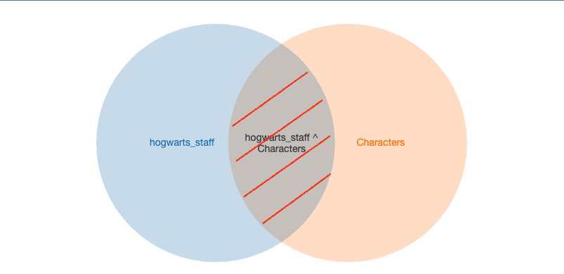
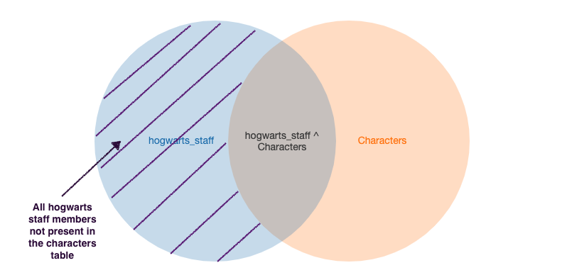
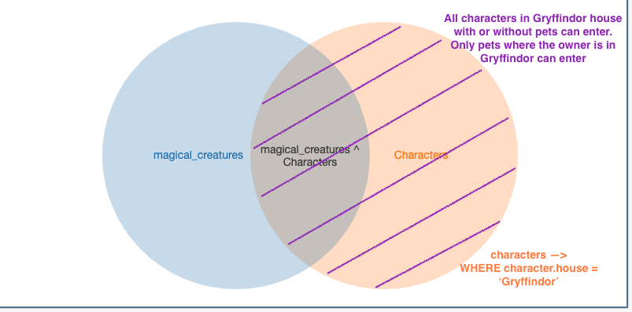

#### 1. Hogwarts wants to conduct an audit of all the points awarded by teachers, to make sure they aren't favoring any particular house.  Find the houses of all hogwarts staff.



```sql 
potter=# SELECT hogwarts_staff.name, characters.house FROM hogwarts_staff JOIN characters ON hogwarts_staff.name = characters.name WHERE characters.house IS NOT NULL;
                  name                   |   house
-----------------------------------------+------------
 Amycus Carrow                           | Slytherin
 Alecto Carrow                           | Slytherin
 Albus Percival Wulfric Brian Dumbledore | Gryffindor
 Filius Flitwick                         | Ravenclaw
 Rubeus Hagrid                           | Gryffindor
 Gilderoy Lockhart                       | Ravenclaw
 Remus John Lupin                        | Gryffindor
 Minerva McGonagall                      | Gryffindor
 Quirinus Quirrell                       | Ravenclaw
 Horace Eugene Flaccus Slughorn          | Slytherin
 Severus Snape                           | Slytherin
 Pomona Sprout                           | Hufflepuff
 Sybill Patricia Trelawney               | Ravenclaw
 Dolores Jane Umbridge                   | Slytherin
(14 rows)
```
#### 2. While performing an audit of our database tables, the wizarding analyst discovers that we have missing data. Find all the teachers that are not present in the characters table. 



```sql 

potter=# SELECT hogwarts_staff.name, hogwarts_staff.subject_or_position
potter-# FROM hogwarts_staff LEFT JOIN characters
potter-# ON hogwarts_staff.name = characters.name
potter-# WHERE characters.name IS NULL;
        name         |        subject_or_position
---------------------+-----------------------------------
 Argus Filch         | Caretaker
 Silvanus Kettleburn |         Care of Magical Creatures
 Aurora Sinistra     | Astronomy
(3 rows)

```

#### 3. The Fat Lady's portrait is updating her knowledge to make sure only authorized folks have access to the Gryffindor dorm. Can we write a query that will inform us of all the students (past and present) and pets that are allowed in the Gryffindor dormitory? 




```sql 
SELECT characters.name, magical_creatures.name, characters.house
FROM magical_creatures
RIGHT JOIN characters
ON magical_creatures.owner = characters.name
WHERE characters.house = 'Gryffindor';
```

```sh

                  name                   |    name     |   house
-----------------------------------------+-------------+------------
 Hermione Jean Granger                   | Crookshanks | Gryffindor
 Albus Percival Wulfric Brian Dumbledore | Fawkes      | Gryffindor
 Harry James Potter                      | Hedwig      | Gryffindor
 Sirius Black                            | Kreacher    | Gryffindor
 Ronald Bilius Weasley                   | Scabbers    | Gryffindor
 Ronald Bilius Weasley                   | Pigwidgeon  | Gryffindor
 Percy Ignatius Weasley                  | Hermes      | Gryffindor
 Ginevra (Ginny) Molly Weasley           | Arnold      | Gryffindor
 Rubeus Hagrid                           | Aragog      | Gryffindor
 Rubeus Hagrid                           | Buckbeak    | Gryffindor
 Rubeus Hagrid                           | Fluffy      | Gryffindor
 Rubeus Hagrid                           | Tenebrus    | Gryffindor
 Dean Thomas                             | (NULL)      | Gryffindor
 Oliver Wood                             | (NULL)      | Gryffindor
 Parvati Patil                           | (NULL)      | Gryffindor
 James Sirius Potter                     | (NULL)      | Gryffindor
 Minerva McGonagall                      | (NULL)      | Gryffindor
 Lavender Brown                          | (NULL)      | Gryffindor
 Colin Creevey                           | (NULL)      | Gryffindor
 Angelina Johnson                        | (NULL)      | Gryffindor
 (Bill) William Arthur Weasley           | (NULL)      | Gryffindor
 Lee Jordan                              | (NULL)      | Gryffindor
 Romilda Vane                            | (NULL)      | Gryffindor
 Cormac McLaggen                         | (NULL)      | Gryffindor
 Remus John Lupin                        | (NULL)      | Gryffindor
 Lily J. Potter                          | (NULL)      | Gryffindor
 Godric Gryffindor                       | (NULL)      | Gryffindor
 Dennis Creevey                          | (NULL)      | Gryffindor
 Arthur Weasley                          | (NULL)      | Gryffindor
 Katie Bell                              | (NULL)      | Gryffindor
 Seamus Finnigan                         | (NULL)      | Gryffindor
 Neville Longbottom                      | (NULL)      | Gryffindor
 George Weasley                          | (NULL)      | Gryffindor
 Peter Pettigrew                         | (NULL)      | Gryffindor
 Nicholas de Mimsy-Porpington            | (NULL)      | Gryffindor
 Frank Longbottom                        | (NULL)      | Gryffindor
 Rose Granger-Weasley                    | (NULL)      | Gryffindor
 Charles Weasley                         | (NULL)      | Gryffindor
 Fred Weasley                            | (NULL)      | Gryffindor
 James Potter                            | (NULL)      | Gryffindor
 Alicia Spinnet                          | (NULL)      | Gryffindor
 Molly Weasley                           | (NULL)      | Gryffindor
```